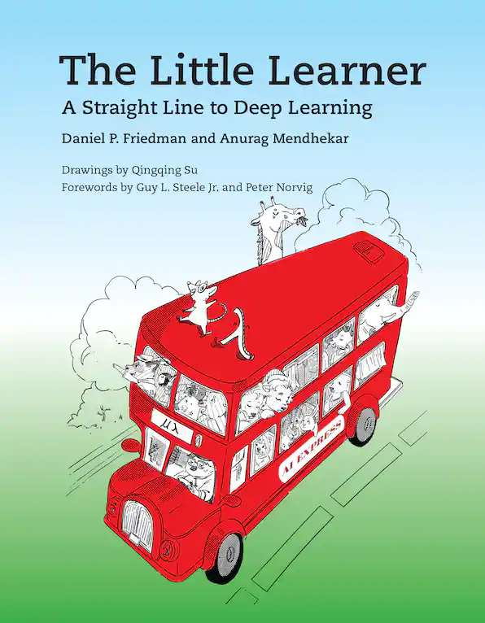

# The Little Learner in OCaml

The book seems to be a unique book to talk about deep-learning domain using functional programming languages. It tries to demonstract how general purpose functional programming can be used to model distinct domains.

While the book is using Racket (a modern dialect of scheme), this repo contains my implementations in OCaml and various reading notes.

## Reading notes
- [x] Chpater 1. Introduce the first target function: Line `y=ax+b`
- [x] Chpater 2. Tensor and common operations of tensor like shape/rank...
- [x] Interlude I. Introduce the concept of extended to apply function to tensors
- [x] Chpater 3. introduce concepts of objection function, loss function, target function, expectatnt function
- [ ] Chapter 4. gradient and gradient descent
- [ ] Interlude II. Introduce hyper parameters and how to set them using `with`
- [ ] Chpater 5.
  * introduce generalization of gradient descent with
    * hyperparameters revision and learning rate
    * generalize data set where higher ranked tensor can be expected
    * generalize parameters where a list of tensors can be expected
  * introduce a new target function: plane `y = (a_0 * x_0 + a_1 * x_1) + c`
- [ ] Chpater 6. stochastic gradient descent by sampling data set
- [ ] Chapter 7. Further generliaze graident descent with
  * inflate
  * deflate
  * update
- [ ] Chapter 8. momentum gradient descent - new velocity is determined by 1. retaining a proportion of previous velocity and 2. gradient
  * `v_{t+1} = mu * v_{t} - learning rate * graidient`
- [ ] Ghost in the shell: implement graident operator
  * reverse mode: **expliclity** construct a chain of primitives (like tapes recrod every step)
  * link: a function that manages 1) the chain that produced this scalar 2) is invoked for walking the chain

## TODO
- [ ] Ghost in the shell: implement graident operator
- [ ] try out alcotest
